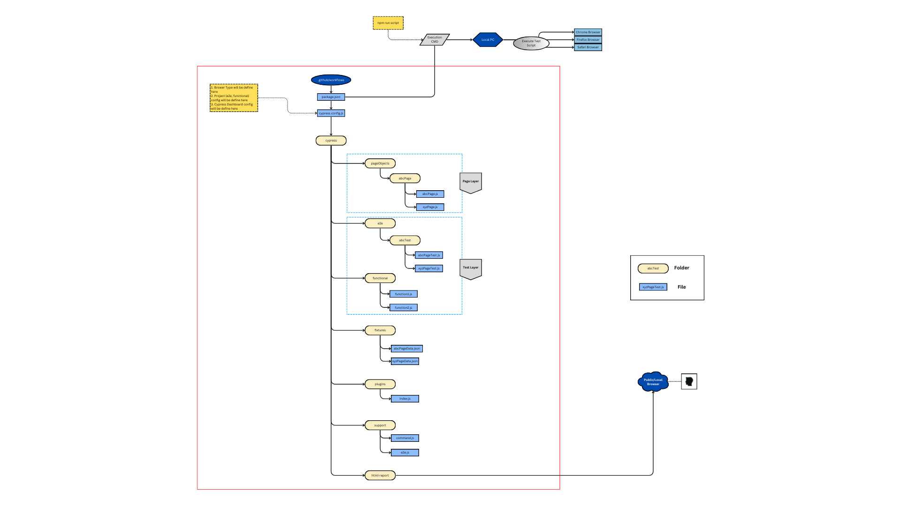
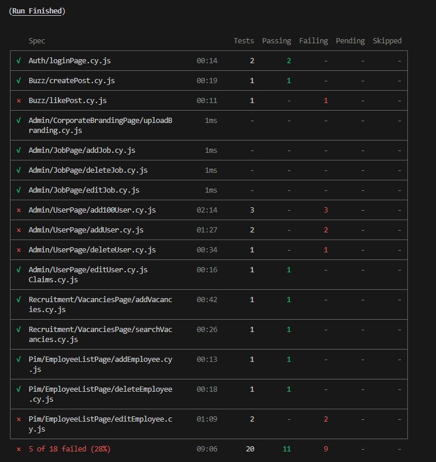
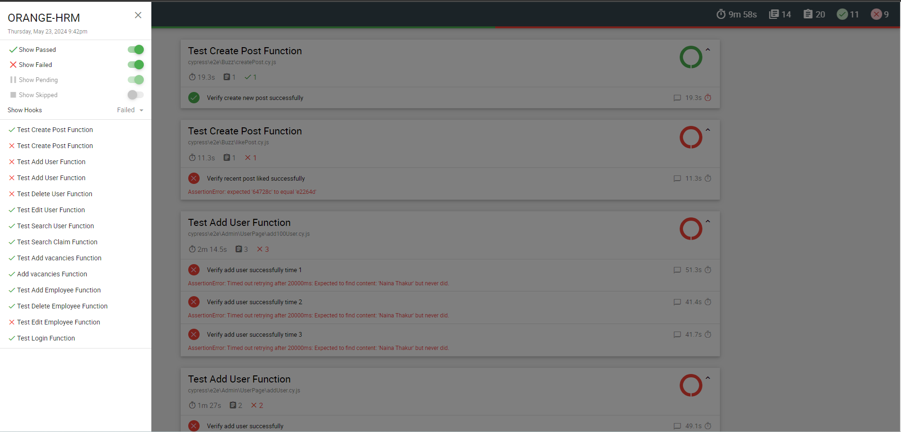
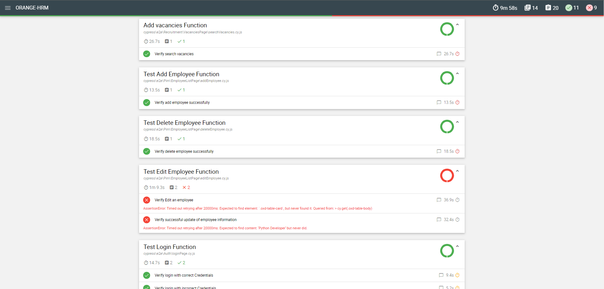
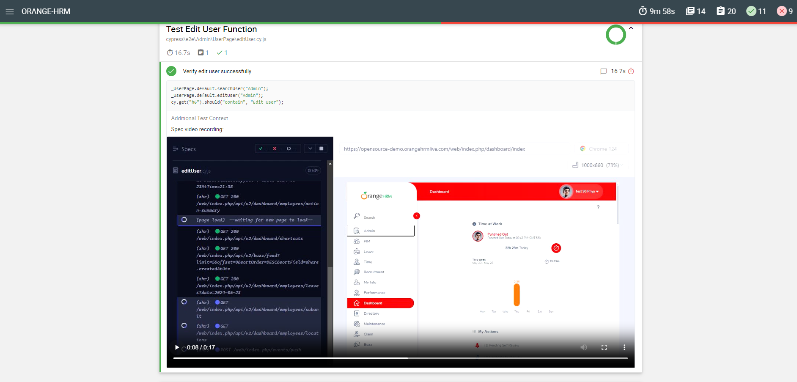
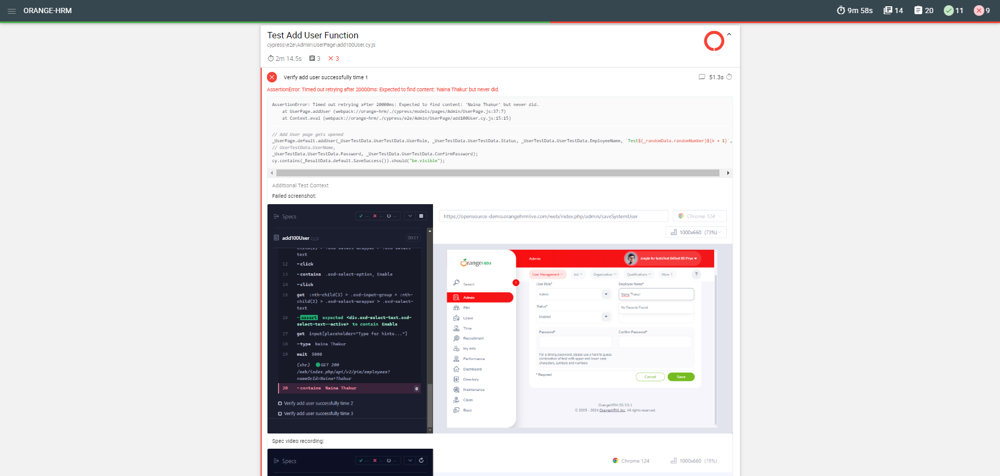
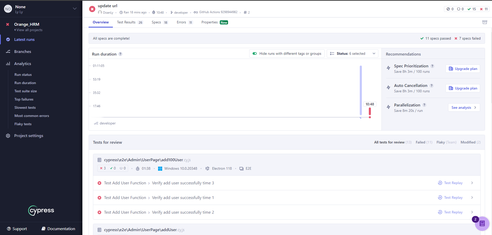
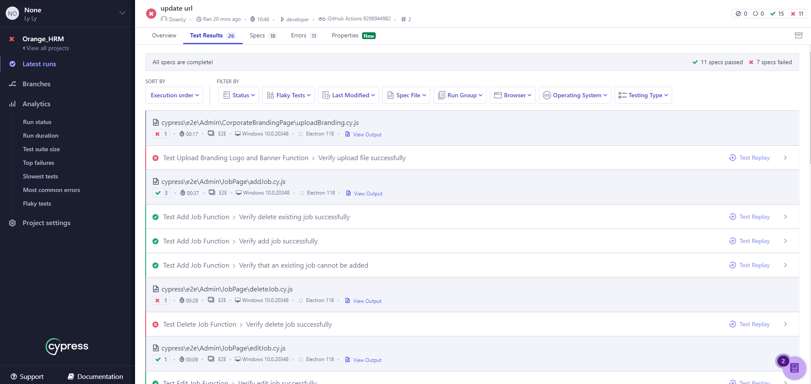

# Orange HRM Site Automation

This is my cypress project.

#### Project website link: https://opensource-demo.orangehrmlive.com/  

---

## Technology:  

- Automation Framework: Cypress  
- Build tool: npm  
- Bundled Tools: Mocha, Chai
- Language: Javascript  
- Report: Cypress Cloud 
- Project Structure: Page object Model (POM) 
- IDE: Visual Studio Code  

---

## Project Architecture:  

---

## Test scenario: 

<ol>
<li>Automate Login Function</li>

- Login with correct credentials
- Login with incorrect credentials

<li>Automate Admin Function</li>

- Add a user to the system
- Add a user to the system with existing username
- Add a job
- Delete a job

<li>Automate PIM Function</li>

- Add an employee
- Edit an employee
- Delete an employee

<li>Automate Recruitment Function</li>

- Add a vacancy
- Delete a vacancy

<li>Automate Maintenance Function</li>

- Access to maintenance mode
- Access to maintenance mode with incorrect credentials

<li>Automate Buzz Function</li>

- Create a post
- Like a post
</ol>

---

## Run the Automation Script:

1. Open cmd to the project folder using VS Code
2. Type this command:
   npm run test
3. After Complete the test execution Report will generate to reports Folder
4. Run the index.html file using any live server extension(e.g. Live Server) to view the html report

---

## Test Report view from Command line:

## Test Report view from HTML report:

## Test Report view from Cypress Dashboard:

